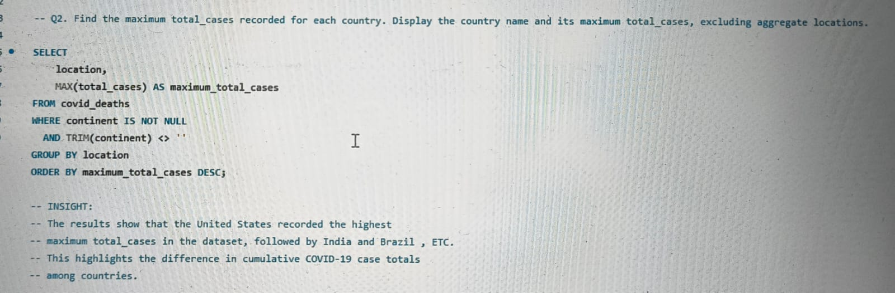
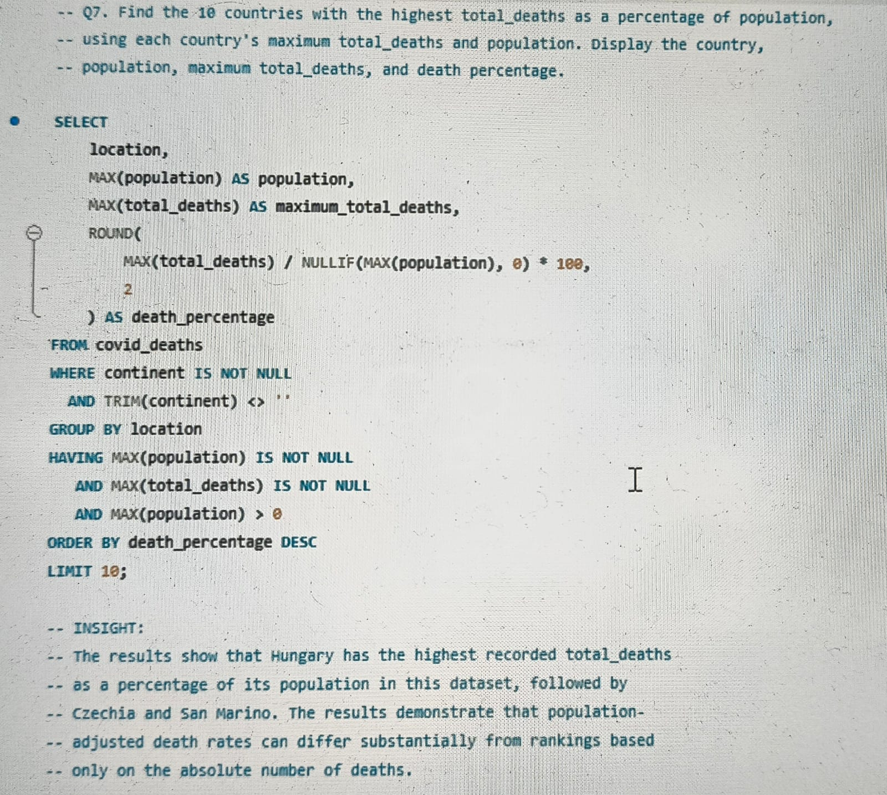
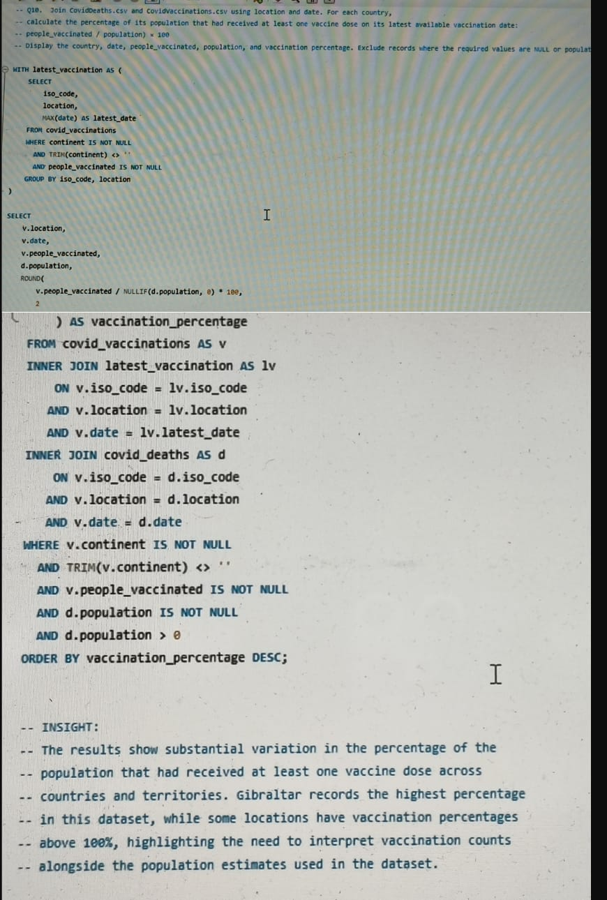
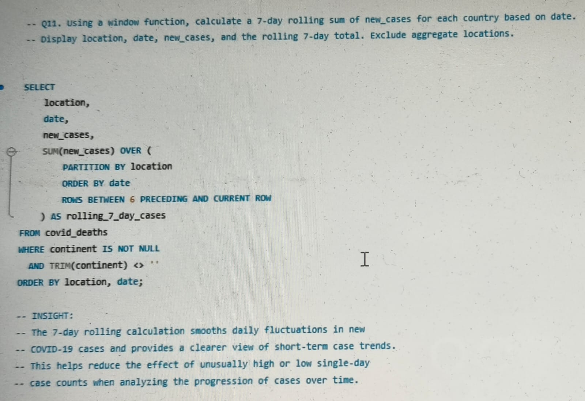
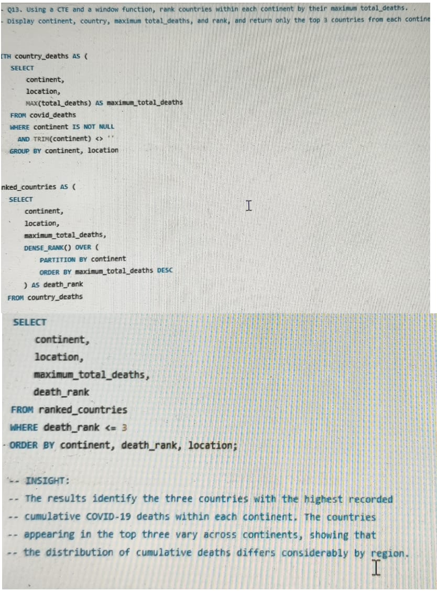
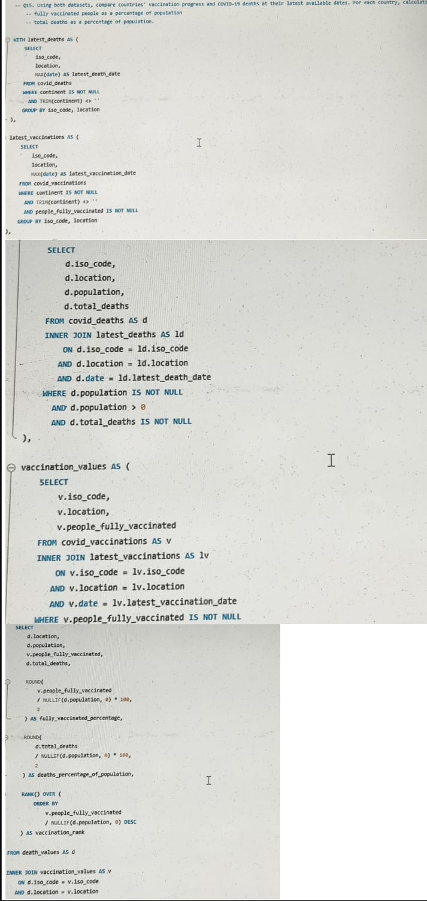

````markdown
# COVID-19 Data Analysis Using MySQL

## 👤 Project Information

**Name:** Gariman Mishra  
**Project:** COVID-19 Data Analysis Using MySQL  
**Role:** Aspiring Data Analyst  
**Tool:** MySQL  
**Database:** `covid_project`  
**Datasets:** CovidDeaths.csv, CovidVaccinations.csv  
**SQL Questions:** 15  
**Difficulty Levels:** Basic, Intermediate, Advanced  

---
## 📂 Dataset Source

The datasets used in this project were obtained from Kaggle:

- `CovidDeaths.csv`
- `CovidVaccinations.csv`

The datasets contain country-wise and date-wise COVID-19 cases, deaths, population, and vaccination-related information.

## 📌 Project Overview

This project analyzes real-world COVID-19 data using MySQL to extract meaningful insights about the global impact and progression of the pandemic.

The analysis uses two datasets — **CovidDeaths** and **CovidVaccinations** — containing country-wise and date-wise information on COVID-19 cases, deaths, population, and vaccination progress.

The project contains **15 SQL questions** divided into three difficulty levels: Basic, Intermediate, and Advanced.

---

## 🎯 Project Objective

The primary objective of this project is to demonstrate how SQL can be used to transform raw COVID-19 data into structured analysis and meaningful data insights.

The project also demonstrates practical skills in querying, aggregation, data comparison, JOINs, CTEs, window functions, time-series analysis, and population-adjusted metrics.

---

## 🔎 Analysis Performed

### Basic Analysis

1. Country-wise COVID-19 cases and deaths
2. Maximum total cases by country
3. Maximum total deaths by country
4. Total new cases by continent
5. Top 10 countries by population

### Intermediate Analysis

6. Case fatality percentage
7. Deaths as a percentage of population
8. Average daily new cases
9. Date countries reached 100,000 cases
10. Vaccination coverage

### Advanced Analysis

11. 7-day rolling cases
12. Day-over-day case changes using `LAG()`
13. Country ranking within continents
14. Highest daily new cases using `ROW_NUMBER()`
15. Vaccination and death comparison

---

## 🛠️ SQL Concepts Used

- SELECT & WHERE
- GROUP BY & HAVING
- ORDER BY & LIMIT
- Aggregate Functions
- NULL Handling
- INNER JOIN
- CTEs
- Window Functions
- `LAG()`
- `ROW_NUMBER()`
- `DENSE_RANK()`
- `RANK()`
- Rolling Calculations
- Percentage Calculations
- Date-based Analysis

---

## 📊 Key Insights

- Countries differed considerably in their maximum recorded COVID-19 cases and deaths.
- Population-adjusted metrics produced different comparisons from absolute counts.
- Average daily case counts varied considerably between countries.
- Countries reached major case thresholds at different points in time.
- Vaccination coverage varied across countries and territories.
- Rolling calculations helped identify short-term case trends.
- Window functions allowed country rankings and peak-case analysis.

---

## 📁 Repository Structure

```text
COVID-19-MySQL-Analysis/
│
├── README.md
│
└── covid19_analysis.sql
````

---

## ▶️ How to Run the Project

1. Install MySQL and MySQL Workbench.
2. Create the database:

```sql
CREATE DATABASE covid_project;
```

3. Import the COVID-19 datasets into the required tables:

```text
covid_deaths
covid_vaccinations
```

4. Open `covid19_analysis.sql` in MySQL Workbench.
5. Select the `covid_project` database.
6. Execute the queries to reproduce the analysis.

---

## 📌 Conclusion

This project demonstrates how SQL can transform large, 
time-series COVID-19 datasets into meaningful country-, continent-, and population-level analysis.


---

## 📸 Project Screenshots

### Q2 — Maximum COVID-19 Cases



### Q7 — Deaths as Percentage of Population



### Q10 — Vaccination Coverage



### Q11 — 7-Day Rolling Cases



### Q13 — Continental Ranking



### Q15 — Final Analysis



It demonstrates practical skills in data querying,
aggregation, JOINs, CTEs, window functions, time-series analysis, population-adjusted metrics, and data interpretation.

```
```
